# RenoAI — an AI renovator that replaces your interior designer's coordination layer

## TL;DR

- **Track:** OPC / Super Individuals (primary) — also fits Autonomous Agents
- **What:** An agentic service that gives Singapore HDB homeowners ID-level design, compliance and supervision — at contractor-direct prices. The agent does the coordination work an interior design firm charges 30–50% markup for; the human keeps taste sign-off and final approval.
- **Why us:** Built on a **real 9-month renovation dispute** — 2,171 WhatsApp messages between a homeowner and an ID firm (peak crisis month: 715 messages). Every demo step runs on this real data, not synthetic fixtures.
- **Where it lives:** Not another app. Renovation coordination in Singapore happens in WhatsApp — the agent rides the homeowner's own WhatsApp identity; approvals happen in your "Message Yourself" chat. Contractors see a well-organized homeowner, not a bot.
- **Stack:** Claude Code + Claude API (vision + tool use) for floor-plan reading, compliance triage and message drafting; Replicate (nano-banana) for structure-locked renders; whatsapp-web.js for a live WhatsApp supervision bridge.

## How you use it (no new app)

1. **Link once.** Scan a QR from your phone (WhatsApp → Linked Devices) — the exact same gesture as WhatsApp Web. That's the entire installation.
2. **Create your console.** Make a WhatsApp group for your household (you + spouse/family) — e.g. "RenoAI Console". Group membership is the permission system: anyone in it can feed the agent and approve its actions.
3. **Feed it.** Drop your floor plan or room photo into the console with a one-line brief ("hack the study wall, japandi style, S$50k"). The agent replies in the console with the verified structural fact layer, green/amber/red compliance triage (citations verbatim from hdb.gov.sg) and a structure-locked render.
4. **Supervise.** The agent watches your renovation group with contractors. Every promise ("tiling done by Friday") is logged to the commitment ledger; overdue promises trigger drafted chase messages delivered to your console — reply `ok 1` to send as yourself, `no 1` to discard. Either spouse can approve.

**Privacy model:** whitelist-only. The agent subscribes to exactly two chats — your console and your renovation group. Every other conversation is dropped at the event entry point: not read, not parsed, not stored. Every outgoing message requires explicit human approval.

## Capability map

```mermaid
flowchart TD
    RA["🤖 RenoAI — one-person renovation company<br/><b>agent executes · human holds judgment</b>"]

    RA --> P["1 · Fact layer (perception)"]
    P --> P1["Floor plan → mm/px calibration,<br/>structural extraction"]
    P --> P2["Per-room briefs: walls, windows,<br/>doors, camera — machine-readable"]
    P --> P3["L0 plan = immutable ground truth;<br/>every overlay diff-checked against it"]

    RA --> D["2 · Design & render"]
    D --> D1["Per-room structure-locked renders<br/>(HDB typology prior: no invented<br/>floor-to-ceiling windows)"]
    D --> D2["Audit hook: generate → machine-audit<br/>→ surgical re-edit → re-audit"]
    D --> HG1{{"👤 HUMAN: taste sign-off"}}

    RA --> C["3 · Compliance triage"]
    C --> C1["Work items → 🟢/🟡/🔴 vs scraped<br/>hdb.gov.sg corpus (21 files, verbatim)"]
    C --> C2["Citation gate: exact-match quote<br/>+ URL or the claim is rejected"]
    C --> B1[/"⛔ BOUNDARY: decision support only.<br/>Permits, structural works, sign-offs stay with<br/>HDB-registered contractors & professional engineers"/]

    RA --> PR["4 · Procurement"]
    PR --> PR1["Scope → line-item RFQs →<br/>quotes parsed into ledger"]
    PR --> PR2["Catalog analysis → top-3<br/>with pros & cons (Phase A)"]
    PR --> PR3["🧠 Decision-profile learning →<br/>agent picks directly (Phase B)"]
    PR3 --> HG2{{"👤 HUMAN: confirm every pick"}}

    RA --> S["5 · Supervision (lives in WhatsApp)"]
    S --> S1["Commitment ledger: every promise<br/>logged with date; slippage = mechanical"]
    S --> S2["Proactive chase & reply drafts"]
    S --> HG3{{"👤 HUMAN GATE: nothing is ever sent<br/>without an explicit ok — hard invariant"}}

    RA --> PV["Privacy & control plane"]
    PV --> PV1["Whitelist-only: console group +<br/>reno group; all else dropped at entry"]
    PV --> PV2["Family console group = ACL:<br/>spouse & family can feed and approve"]
    PV --> PV3["No new app: rides the homeowner's<br/>own WhatsApp identity"]

    classDef boundary fill:#fff0f0,stroke:#cc0000,stroke-width:2px,stroke-dasharray:6 4
    classDef human fill:#fff8dc,stroke:#b8860b,stroke-width:2px
    classDef root fill:#eef6ff,stroke:#1a6bb8,stroke-width:2px
    class B1 boundary
    class HG1,HG2,HG3 human
    class RA root
```



**The one rule that never bends:** the agent prepares, verifies and drafts; the human decides. Every irreversible step — message send-off, product pick, design sign-off, and everything requiring a licence — passes through a human or a licensed professional.

## The 4-step agentic chain

1. **Floor plan → immutable fact layer.** mm/px calibration from printed dimension lines, structural extraction, verified overlays with read-back diff hooks.
2. **Compliance triage.** Work items classified green/amber/red against HDB rules; a citation-verification gate rejects any rule citation that does not verbatim-match our scraped hdb.gov.sg corpus (`data/hdb_corpus/`).
3. **Contractor-direct RFQ.** Scope → line-item RFQs → quotes parsed into a commitment ledger.
4. **WhatsApp supervision.** Live bridge logs contractor promises into the ledger, chases slippage, drafts escalations — a human approves every outgoing message before it is sent.

## Repo layout

```
agent/
  factlayer/    floor plan → verified structural overlay (+ diff hooks)
  compliance/   green/amber/red triage + citation-verification gate
  rfq/          RFQ generation + quote parsing
  ledger/       commitment ledger + slippage detection
  bridge/       WhatsApp bridge + human approval send-gate
data/
  hdb_corpus/   scraped hdb.gov.sg rules (citation ground truth)
  fixtures/     sanitized demo data
scripts/        sanitize gate (pre-commit PII blocker)
demo/           demo drivers
```

## Boundary

We do not replace licensed contractors or professional engineers; all structural works are executed by HDB-registered contractors under permit, and the agent's compliance output is decision support, with the homeowner holding final sign-off.

## What's real vs. staged (honest disclosure)

Real and working today: structure-locked render pipeline ($0.04/render), metric-grounded floor-plan extraction, WhatsApp bridge (live), 2,171-message parsed corpus, HDB rules corpus with citation gate. Hardcoded for the demo: payment, auth, multi-user persistence.
