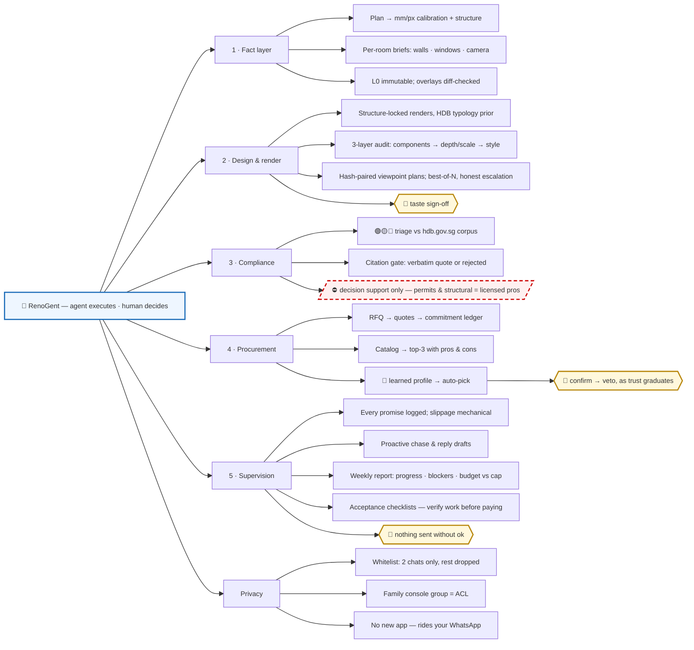
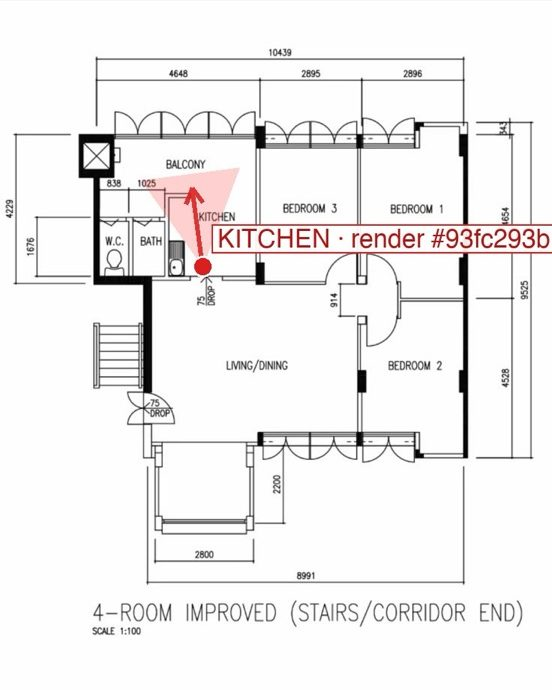
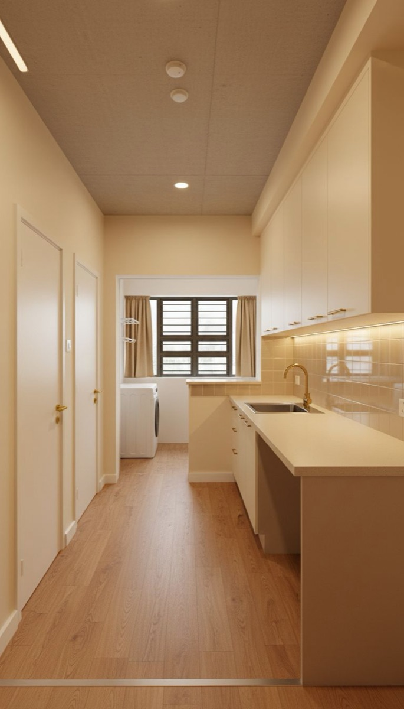
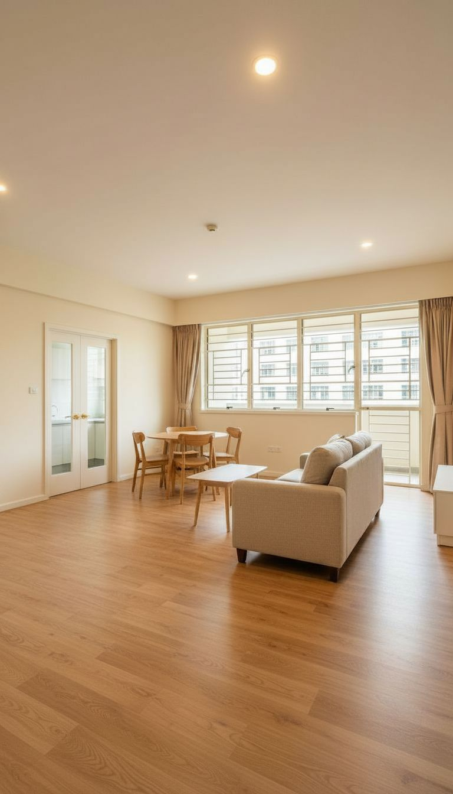

<p align="center"></p>

# RenoGent — an AI renovator that replaces your interior designer's coordination layer

<p align="center"><em>The logo is the product: a floor plan, a camera, and the proof they match.</em></p>

<p align="center">
  <a href="https://littlejuju.github.io/RenoGent/"><b>🌐 Landing page</b></a> ·
  <a href="#capability-map">Capability map</a> ·
  <a href="#verified-renders-not-ai-fantasy">Verified renders</a> ·
  <a href="#whats-real-vs-staged-honest-disclosure">What's real</a>
</p>

## Judges: 60 seconds

```bash
npm ci && npm run demo     # offline — replays recorded outputs of the real pipeline, no API key needed
```

Node 18+, no other setup. Verified on a fresh clone: install + demo under a minute.

Three things worth your attention:
1. **The citation gate** — every HDB rule the agent cites is machine-verified as a verbatim substring of the scraped hdb.gov.sg corpus (`agent/compliance/`). Hallucinated regulation cannot reach the user.
2. **Hash-paired render audits** — every render ships with a stamped plan copy proving where its camera stands, then a 3-layer audit; structural failures are never released (`agent/factlayer/`, images below).
3. **The human gate** — every outgoing WhatsApp message needs an explicit human `ok`; the automation channel physically cannot release one (`agent/bridge/supervisor.js`).

## TL;DR

- **Track:** OPC / Super Individuals (primary) — also fits Autonomous Agents
- **What:** An agentic service that gives Singapore HDB homeowners ID-level design, compliance and supervision — at contractor-direct prices. The agent does the coordination work an interior design firm charges 30–50% markup for; the human keeps taste sign-off and final approval.
- **Why us:** Built on a **real 9-month renovation dispute** — 2,171 WhatsApp messages between a homeowner and an ID firm (peak crisis month: 715 messages). Every demo step runs on this real data, not synthetic fixtures.
- **Where it lives:** Not another app. Renovation coordination in Singapore happens in WhatsApp — RenoGent drafts inside your private homeowner console, and nothing is sent until a human approves. But supervision is the training set, not the ceiling: every approval teaches the agent how you decide, your picks distill into a decision profile, and domains where the profile is proven graduate to autopilot (already live for material picks) — the agent decides, you keep veto. Over months it becomes a coordinator you've personally trained to decide like you.
- **Stack:** Claude Code + Claude API (vision + tool use) for floor-plan reading, compliance triage and message drafting; Replicate (nano-banana) for structure-locked renders; whatsapp-web.js for a live WhatsApp supervision bridge.

## How you use it (no new app)

1. **Link once.** Scan a QR from your phone (WhatsApp → Linked Devices) — the exact same gesture as WhatsApp Web. That's the entire installation.
2. **Create your console.** Make a WhatsApp group for your household (you + spouse/family) — e.g. "RenoGent Console". Group membership is the permission system: anyone in it can feed the agent and approve its actions.
3. **Feed it.** Drop your floor plan or room photo into the console with a one-line brief ("hack the study wall, japandi style, S$50k"). The agent replies in the console with the structural fact layer, green/amber/red compliance triage (citations verbatim from hdb.gov.sg) and audited render attempts. The current whole-unit package covers kitchen, living/dining, bedroom, bath and study; kitchen is the strict-audited pass, while the other rooms are labelled selected or alternate assets with viewpoint proofs.
4. **Supervise.** The agent watches your renovation group with contractors. Every promise ("tiling done by Friday") is logged to the commitment ledger; overdue promises trigger drafted chase messages delivered to your console — reply `ok 1` to send as yourself, `no 1` to discard. Either spouse can approve.
5. **Stay on top without asking.** Reply `report` (or wait for Monday 9am) for progress, blockers, budget-vs-cap — and trade-matched acceptance checklists for freshly completed work, so you know how to inspect before you pay. `redo BEDROOM 1` re-renders a single room; `budget 48000` sets your cap.

**Privacy model:** whitelist-only. The agent subscribes to exactly two chats — your console and your renovation group. Every other conversation is dropped at the event entry point: not read, not parsed, not stored. Every outgoing message requires explicit human approval.

## Capability map



**The trust model: autonomy is earned, per domain.** Day one, the agent prepares, verifies and drafts; the human decides everything. Each decision it watches you make becomes training data — approved picks distill into an explicit decision profile (priority rules with evidence, reviewable in `agent/skills/`). Once a domain's profile is proven, that domain graduates: the agent decides, the human holds a revocable veto instead of a pre-approval. Material selection is mid-graduation in the live build: the agent already auto-picks under your learned profile and states its reasoning; you confirm with one word. The floor that never moves: outbound messages and everything requiring a licence stay behind a human or a licensed professional.

## Verified renders, not AI fantasy

AI renders love to invent windows and stretch rooms. Here they don't get to: every render is
**hash-paired** to a stamped copy of the floor plan showing exactly where its camera stands,
then machine-audited in three ordered layers — ① components (every wall/door/window/beam
reconciled against a manifest traced from the plan), ② depth & scale against the plan's printed
mm dimensions, ③ HDB typology & the homeowner's brief (prohibitions like "no grid on windows"
are hard constraints). A render that can't pass after bounded retries (2 fresh bases × 2 surgical
edits, plateau early-exit) is released as **best-of-N, labelled NOT passed**, with the remaining
violations listed — never silently shipped.

The render path also has a **meta-audit** layer: generation prompts are preflighted for
fact-layer contradictions, visual audit results are checked for schema/logic consistency,
and useful-but-off-contract renders are registered as alternate-view assets instead of being
counted as primary passes. See [docs/meta-audit.md](docs/meta-audit.md).

| The viewpoint plan | The audited render |
|---|---|
|  |  |
| Red dot = camera, cone = what it sees, stamped `#93fc293b` | Same hash `#93fc293b` — the pair can't be mixed up |

### Whole-unit package from the same non-standard HDB plan

These are intentionally labelled assets, not all claimed as strict passes: the kitchen proves the full audit loop, while the rest show the unit-scale package and keep their viewpoint-proof trail.

| Living / Dining | Bedroom 1 |
|---|---|
|  |  |
| selected asset + [viewpoint proof](docs/assets/viewpoint-living-dining.jpg) | selected asset + [viewpoint proof](docs/assets/viewpoint-bedroom-1.jpg) |

| Bath | Study |
|---|---|
|  |  |
| selected asset + [viewpoint proof](docs/assets/viewpoint-bath.jpg) | alternate asset + [viewpoint proof](docs/assets/viewpoint-study.jpg) |

## The agentic chain

1. **Floor plan → immutable fact layer.** mm/px calibration from printed dimension lines, per-room structural briefs (walls, windows, camera, fixtures, expected-component manifests), persisted as the single reviewable ground truth.
2. **Constrained render + 3-layer audit.** Generate → audit against the fact layer → surgical re-edit or fresh base → honest escalation (see above).
3. **Compliance triage.** Work items classified green/amber/red against HDB rules; a citation-verification gate rejects any rule citation that does not verbatim-match our scraped hdb.gov.sg corpus (`data/hdb_corpus/`).
4. **Procurement that learns you.** Catalog → top-3 with pros/cons; your picks distill into a decision profile (priority rules with evidence); later catalogs are auto-picked under that profile with one-word confirm — the graduation path from "agent proposes" to "agent decides, you veto". Approved scope compiles into line-item RFQs with a shortlist of HDB DRC-registered contractors matched to the works (sample dataset in the demo).
5. **WhatsApp supervision + PM.** Live bridge logs contractor promises into the ledger, chases slippage, drafts escalations — a human approves every outgoing message. Weekly report: progress, blockers, budget vs cap, and acceptance checklists for completed work.

## Repo layout

```
agent/
  factlayer/    plan → per-room briefs · constrained renders · 3-layer audit · viewpoint plans
  compliance/   green/amber/red triage + citation-verification gate
  procurement/  catalog analysis: top-3 or learned auto-pick
  skills/       decision-profile learning (picks → distilled priority rules)
  rfq/          RFQ generation + quote parsing
  ledger/       commitment ledger · slippage detection · weekly report + acceptance checklists
  bridge/       WhatsApp bridge + human approval send-gate + dual-console test router
data/
  hdb_corpus/   scraped hdb.gov.sg rules (citation ground truth)
  fixtures/     sanitized demo data
scripts/        sanitize gate (pre-commit PII blocker)
docs/           GitHub Pages landing (littlejuju.github.io/RenoGent)
demo/           demo drivers
```

## Boundary

We do not replace licensed contractors or professional engineers; all structural works are executed by HDB-registered contractors under permit, and the agent's compliance output is decision support, with the homeowner holding final sign-off.

## What's real vs. staged (honest disclosure)

Real and working today: the WhatsApp bridge as a live test bench; one strict-audited floor-plan-to-render pass for the kitchen with a hash-paired viewpoint plan; a whole-unit selected asset package for living/dining, bedroom, bath and study; metric-grounded floor-plan extraction; compliance triage with all-verbatim citations; decision-profile learning (top-3 → pick → auto-pick); commitment ledger + chase drafts behind the human approval gate; weekly report with budget + acceptance checklists. Hardcoded or staged for the demo: payment, auth, multi-user persistence, and broad production reliability beyond this single-tenant test bench. Renders that fail strict audit are delivered honestly as selected, alternate, NOT passed or style-escalated — never silently shipped as primary passes.
